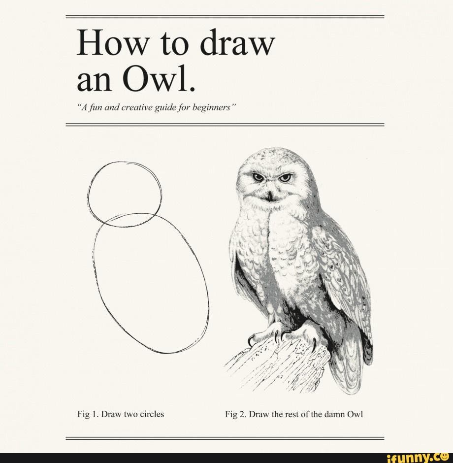
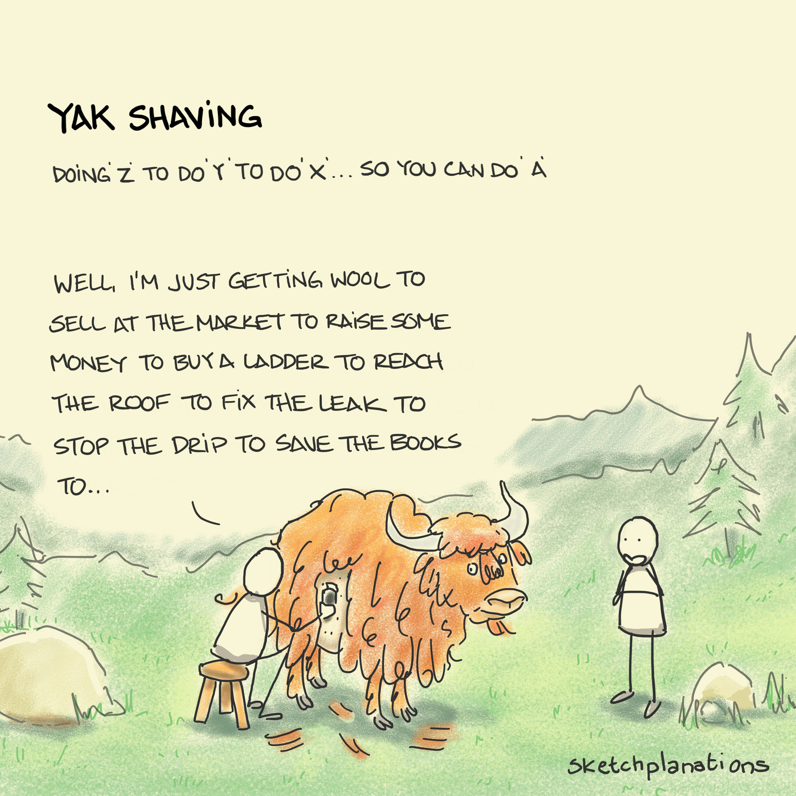
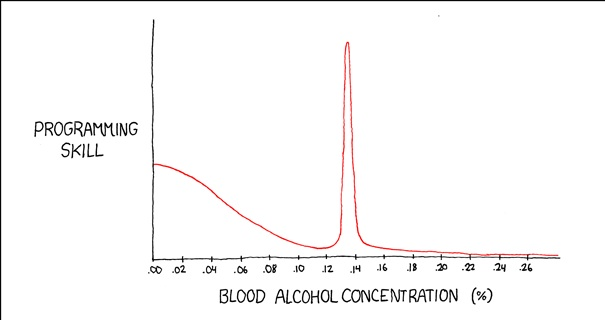
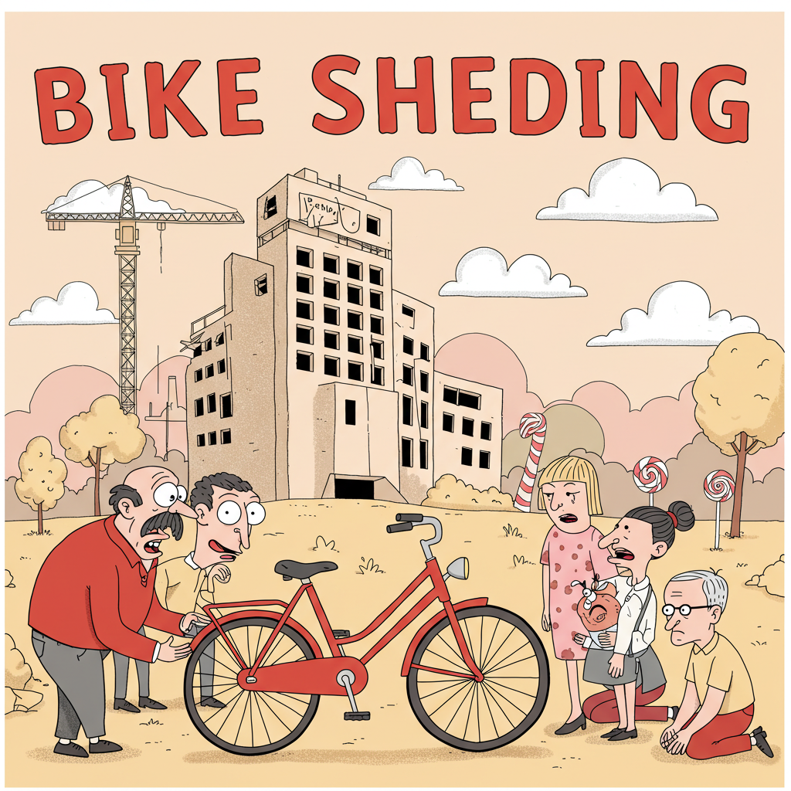
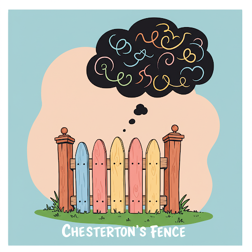
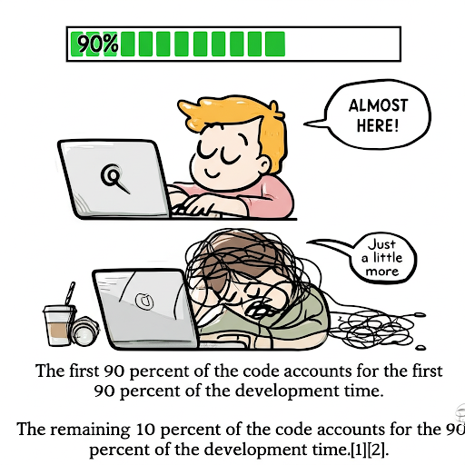
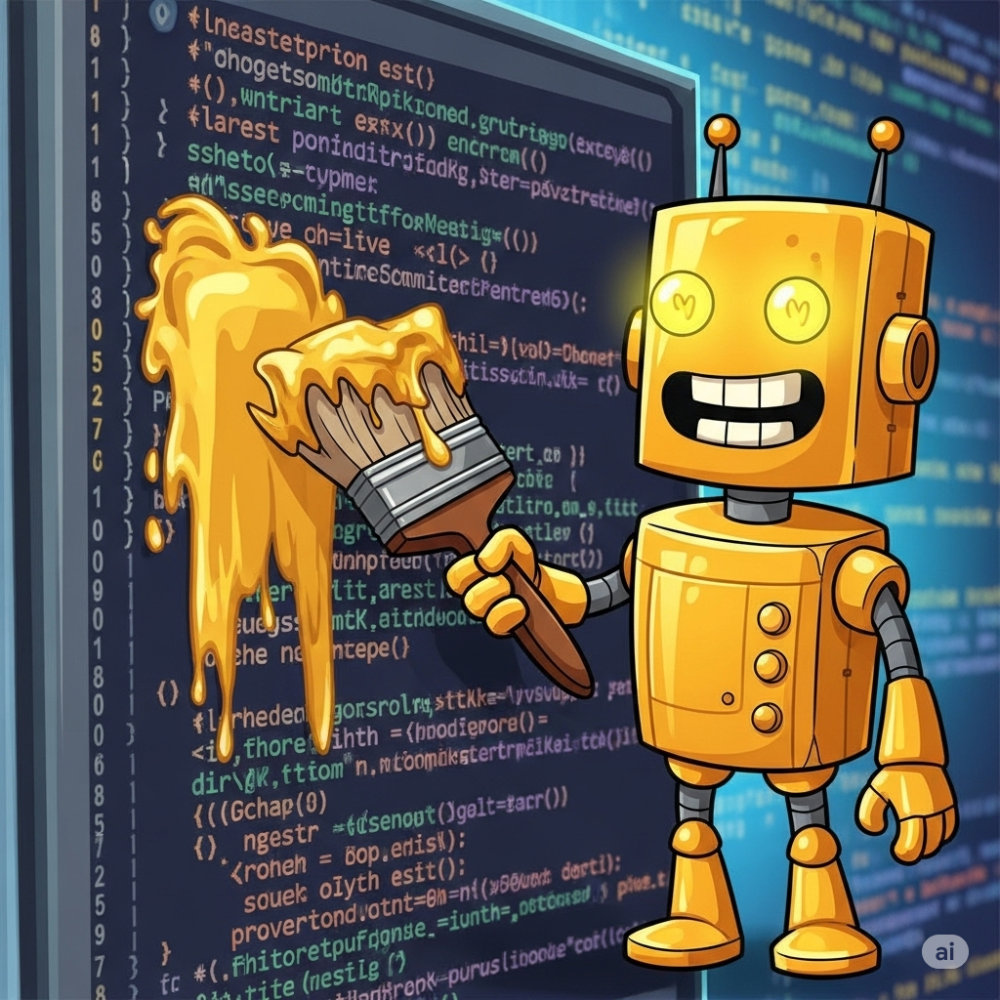
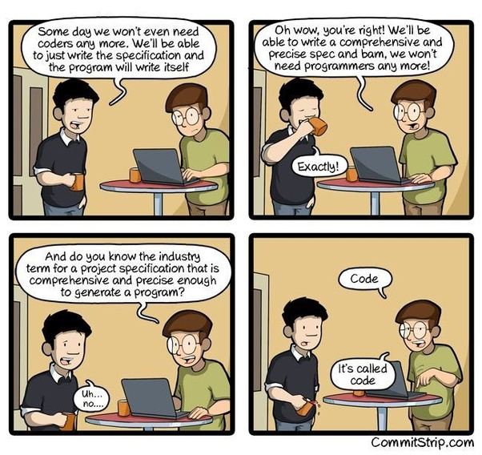
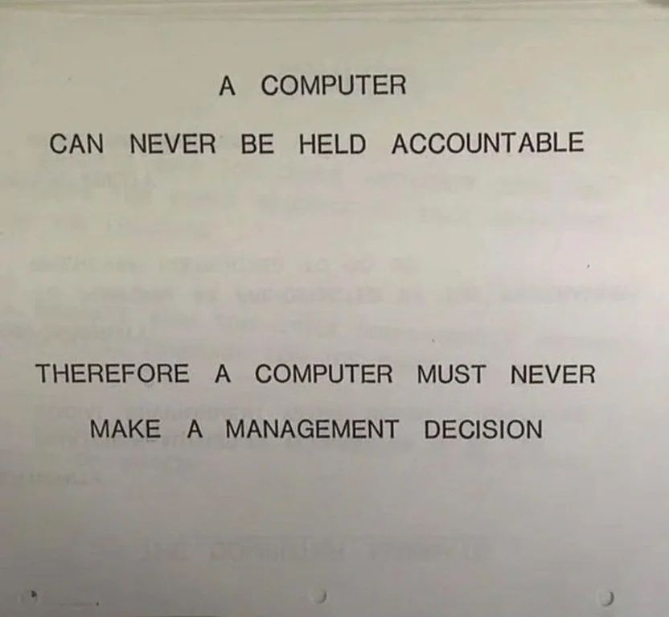

import CustomLink from '../../../components/CustomLink';

After over a decade of working, these are the behaviors and programmer memes that I refer to all the time.

### 1. Draw the rest of the owl

### 2. Yak Shaving

* <CustomLink href="https://seths.blog/2005/03/dont_shave_that/">Resource</CustomLink>

### 2. Automation ROI

### 3. Bugs become features

### 4. Ballmer Peak

### 5. Bike Shedding

* <CustomLink href="https://en.wikipedia.org/wiki/Law_of_triviality">Law of Triviality</CustomLink>

### 6. Chesterton's Fence

### 7. Ninety–ninety rule

* <CustomLink href="https://en.wikipedia.org/wiki/Ninety%E2%80%93ninety_rule">Resource</CustomLink>
* <CustomLink href="https://en.wikipedia.org/wiki/Planning_fallacy">Planning Fallacy</CustomLink>

### 8. Gold-Plating

<u>Requirements gold-plating</u>: Some projects have more requirements than they need right from the beginning. Performance is stated as a requirement more often than it needs to be, and that can unnecessarily lengthen a software schedule. Users tend to be less interested in complex features than marketing and development are, and complex features add disproportionately to a development schedule.

<u>Developer gold-plating</u>: Developers are fascinated by new technology and are sometimes anxious to try out new features of their language or environment or to create their own implementation of a slick feature they saw in another product – whether or not it’s required in their product. The effort required to design, implement, test, document, and support features that are not required lengthens the schedule.

* <CustomLink href="https://blog.codinghorror.com/gold-plating/">Resource</CustomLink>

### 9. Reliance on Dependencies

### 10. Drain the Slides
* To read out loud to everybody in a corporate meeting all the words crammed onto a PowerPoint presentation.
* <CustomLink href="https://martinfowler.com/bliki/Slideument.html">Slideument</CustomLink> - PowerPoint slides that are accomplishing to be bad for both presentations and for reading.  This is most corporate presentations.

### 11. Coding is just writing a spec

### 12. The computer cannot be held responsible

## Other similar articles:
* <CustomLink href="https://newsletter.manager.dev/p/the-13-software-engineering-laws">13 Software Engineering Laws</CustomLink>

